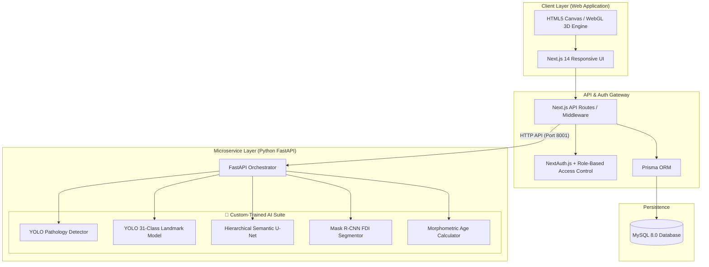

# 🦷 DentalAI — Multi-Modal AI System for Radiographic Diagnosis & Forensic Odontology

[](#license)
[](https://nextjs.org/)
[](https://fastapi.tiangolo.com/)
[](https://pytorch.org/)
[](https://www.docker.com/)
[]()

**DentalAI** is an end-to-end, enterprise-grade AI ecosystem for panoramic dental radiograph analysis, diagnostic pathology identification, student anatomical training, and forensic age estimation. Built specifically for clinical practitioners, forensic odontologists, and dental academics.

---

## 🏆 Key Buildathon Highlights

> [!IMPORTANT]
> ### 🧠 100% Custom-Built AI & Computer Vision Models
> Unlike conventional wrappers around generic API endpoints, **all AI models in DentalAI are fully custom-trained and domain-optimized** for panoramic dental radiographs (OPG):
> 1. **Custom YOLO Pathology Diagnostic Network** (`best.pt`)
> 2. **Custom 31-Class Anatomical Landmark Segmentation YOLO** (`best_landmarks.pt`)
> 3. **Custom Restrictive-Hierarchical Semantic Segmentation U-Net** (`toothpulpmask.pt`)
> 4. **Custom Mask R-CNN FDI Tooth Instance Segmentor** (`maskrcnn_best.pth`)
> 5. **Custom Computer Vision Forensic Age Estimation Engine** (Pulp-to-Tooth Morphometric Pipeline)

---

## 📐 System Architecture



---

## 🧠 Deep Dive: Custom AI Models & Pipelines

### 1. 🩺 Custom YOLO Pathology Diagnostic Model (`best.pt`)
* **Task**: Object detection and pathology localized bounding box regression.
* **Capabilities**: Flags pathological anomalies such as dental caries (cavities), periapical lesions, bone loss, impacted teeth, and dental restorations.
* **Severity Engine**: Color-coded severity scoring (Severe: Red, Moderate: Orange, Mild: Green) with confidence threshold filtering.

### 2. 📍 Custom 31-Class Anatomical Landmark Model (`best_landmarks.pt`)
* **Task**: Polygon segmentation and landmark detection across 31 anatomical structures.
* **Coverage**:
  * **Mandible**: Sigmoid notch, Coronoid process, Ramus, Mandibular canal, Gonial angle, Mental foramen, Lingula, etc.
  * **TMJ**: Condylar head, Glenoid fossa, Articular eminence.
  * **Maxilla**: Maxillary sinus walls/floor, Zygomatic arch, Hard palate, Incisive foramen.
  * **Midline & Other**: Nasal septum, Inferior concha, Hyoid bone.
* **Interactivity**: Dynamic polygon overlay with real-time opacity controls ($0\% - 100\%$) and One-by-One clinical focus mode.

### 3. 🔬 Custom Restrictive-Hierarchical Semantic U-Net (`toothpulpmask.pt`)
* **Task**: Dual-target semantic segmentation of tooth structures and pulp chambers.
* **Architecture**: Restrictive-Hierarchical U-Net trained to segment fine inner tooth geometries for precise pulp area ($A_p$) extraction.

### 4. 🦷 Custom Mask R-CNN FDI Tooth Segmentor (`maskrcnn_best.pth`)
* **Task**: Instance segmentation and FDI (Federation Dentaire Internationale) anatomical numbering (11–48).
* **Capabilities**: Identifies individual teeth, extracts binary masks, isolates target teeth (e.g., Canines 13, 23, 33, 43), and measures root closure apexes.

### 5. 🦴 Custom Computer Vision Forensic Age Estimation Engine
* **Algorithm**: Implements non-invasive Cameriere & Morphometric analysis.
* **Pipeline**:
  1. Segments total tooth area ($A_t$) and pulp chamber area ($A_p$).
  2. Calculates the pulp-to-tooth ratio ($s = A_p / A_t$) and root apex distance ($N_0, A_r$).
  3. Executes mathematical regression equations to compute estimated chronological age, confidence range, and metric weight contributions.

---

## ✨ Core Features & Platform Modules

### 📍 1. Panoramic Radiograph Landmark Detection
* **Validation Gateway**: Automatically scans uploaded images to verify they are valid panoramic X-rays before processing.
* **Multi-Group Classification**: Categorizes detected landmarks into Mandible, TMJ, Maxilla, Midline, and Other.
* **Interactive Tooltips**: Hovering displays clinical definitions, diagnostic significance, and region groupings.

### 🎓 2. Student Education & Diagnostic Quizzing
* **Dynamic Quiz Engine**: Generates 10-question multiple-choice tests using real AI landmark detections.
* **Visual Prompts & Timers**: Highlights target structures with crosshairs and dynamic countdown timers (15s–60s or unlimited).
* **Clinical Feedback**: Gives immediate explanations, scoring metrics, and radial progress tracking.

### 🎨 3. Interactive Landmark Drawing Practice
* **Student Canvas**: Polygon drawing tool allowing students to plot anatomical vertices manually.
* **Real-Time AI Grading**: Evaluates student accuracy against AI ground truth by computing:
  * **Centroid Distance**: Positional alignment metric.
  * **Bounding Box Overlap (IoU)**: Shape and coverage accuracy.
  * **Symmetry Check**: Automatically detects contralateral bilateral drawings for fair scoring.

### 🩺 4. Diagnostic Pathology Mapping & FDI Charting
* **Quadrant Summaries**: Organizes detected pathologies by FDI dental arch quadrants.
* **Digital FDI Arch**: Interactive 32-tooth chart showing status (**Healthy**, **Pathology**, **Restored**, **Missing**).
* **3D Dentition Viewer**: WebGL/Canvas procedural 3D model of upper and lower arches mapping live patient pathologies in 3D.

### 🦴 5. Forensic Odontology Module
* **Visual Age Dial**: Displays estimated age on an interactive gauge with minimum-maximum error boundaries.
* **Morphometric Breakdown**: Shows exact metric weight contributions (eruption patterns, apex closure, pulp ratio).

### 📊 6. Longitudinal Comparison & Medical Report Generator
* **Side-by-Side Panel**: Compares pre- and post-treatment radiographs to highlight clinical changes.
* **Zero-Dependency Reports**: Renders printable medical reports with severity distribution pie charts and PDF/HTML export.

---

## 🔒 Role-Based Access & Security Workflow

The application includes a verification pipeline to restrict sensitive diagnostic access:

```
[ New Registration ] ──> Upload College ID ──> [ Pending State ]
                                                      │
                                                      ▼
                                       Admin Review Dashboard
                                            /           \
                                 [ Approved ]          [ Rejected ]
                                      │                      │
                          Access Granted to Role    Notification & Re-apply
```

* **Student**: Access to learning modules, quizzes, drawing practice, and basic diagnosis.
* **Moderator Admin**: Access to user credential verification dashboard and AI model toggles.
* **Platform Super Admin**: Full platform control, feature flags, domain blocklists, and direct provisioning.

---

## 🛠️ Technology Stack

| Layer | Technology |
| :--- | :--- |
| **Frontend Framework** | Next.js 14 (App Router, React 18) |
| **Styling** | Vanilla CSS Modules, CSS Tokens, Responsive UI |
| **ML Service Framework** | Python 3.11, FastAPI, Uvicorn |
| **Computer Vision / AI** | PyTorch, Ultralytics YOLO, OpenCV, torchvision |
| **Database & ORM** | MySQL 8.0, Prisma ORM |
| **Authentication** | NextAuth.js (JWT, Password Hashing) |
| **Containerization** | Docker, Docker Compose |

---

## 🚀 Quick Start & Deployment

### Prerequisites
* [Docker Desktop](https://www.docker.com/products/docker-desktop/) installed.

### Option A: One-Command Docker Setup (Recommended)

1. **Clone the repository**:
   ```bash
   git clone https://github.com/your-username/dental-ai.git
   cd dental-ai
   ```

2. **Configure Environment Variables**:
   ```bash
   cp .env.docker.example .env
   ```

3. **Launch Container Suite**:
   ```bash
   docker compose up -d --build
   ```

4. **Access Application**:
   Open browser at `http://localhost:3000`

---

### Option B: Local Manual Setup (Development Mode)

#### 1. Setup Database
Start MySQL 8.0 locally or via Docker and ensure standard credentials are configured in `.env`.

#### 2. Start Python ML Microservice
```bash
cd ml-service
python -m venv .venv
# On Windows:
.venv\Scripts\activate
# On Linux/macOS:
source .venv/bin/activate

pip install -r requirements.txt
uvicorn main:app --host 0.0.0.0 --port 8001 --reload
```

#### 3. Start Next.js Frontend
```bash
# In project root
npm install
npx prisma db push
npm run dev
```

---

## 📁 Repository Structure

```
dental/
├── Dockerfile                   # Production Web Dockerfile
├── docker-compose.yml           # Multi-container orchestration
├── .env.docker.example          # Environment template
├── ml-service/                  # Python FastAPI AI Microservice
│   ├── Dockerfile               # ML Service Dockerfile
│   ├── main.py                  # FastAPI routes (YOLO Diagnosis & Landmarks)
│   ├── forensic_pipeline.py     # U-Net & Mask R-CNN Forensic Engine
│   └── models/                  # Custom AI Model Weights (.pt / .pth)
│       ├── best.pt              # Custom YOLO Pathology Model
│       ├── best_landmarks.pt    # Custom YOLO 31-Landmark Model
│       ├── toothpulpmask.pt     # Custom Hierarchical U-Net
│       └── maskrcnn_best.pth    # Custom Mask R-CNN FDI Model
├── src/                         # Next.js Application Source
│   ├── app/                     # App Router Pages & API Routes
│   │   ├── forensics/           # Forensic Odontology Module
│   │   ├── landmark-practice/   # Student Canvas Practice
│   │   ├── admin/               # Role-based Admin Panels
│   │   └── api/                 # Backend proxy & Auth APIs
│   ├── components/              # Modular UI Components (3D viewer, Tooth chart)
│   └── lib/                     # Auth guard, DB clients & utilities
└── prisma/                      # Database Schema & Migrations
```

---

## License

Copyright © 2026 Raj Chavan. All Rights Reserved.

This repository is publicly available solely for evaluation and review purposes, including Razorpay Buildathon judging.

The source code, models, documentation, and other original materials may not be copied, modified, distributed, sublicensed, sold, or used in commercial products or services without prior written permission from the copyright holder.

Viewing and evaluating this repository for educational, judging, or review purposes is permitted.

**No license is granted for reuse, redistribution, modification, or commercial exploitation of this project.**

---

> 
